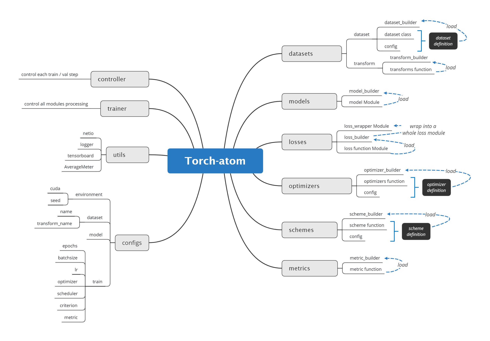

# Torch-atom

[TOC]

## Introduction

A basic and simple training framework for pytorch, easy for extension.



## Dependence

- torch==1.7.0+cu110 (>= 1.6 for data distributed parallel)
- torchvision==0.8.0
- easydict==1.9
- tensorboard==2.7
- tensorboardX==2.4
- PyYAML==5.3.1

## Features

- Any module can be easily customized
- Not abstract, easy to learn, develop and debug
- With a lot of repetitive work reduction, it can be more easily control the training process in development and research
- Friendly to multi-network interactive training, such as GAN, transfer learning, knowledge distillation, etc.
- DDP training support.

## Train

```shell
python main.py --model resnet18 --save_dir cifar100_resnet18 --config_path ./configs/cifar100.yml
```

for ddp training, you can just run the below command in the terminal

```shell
sh run_ddp.sh
```

## Results

### CIFAR100

**All CIFAR100 log files** can be downloaded **in package** here: [pan.baidu](https://pan.baidu.com/s/15tY1a1gkOhhpaTdkCbwtXQ?pwd=3lp2)
code：3lp2


|   Network    | Accuracy |                             log                              |
| :----------: | :------: | :----------------------------------------------------------: |
|   resnet18   |  76.46   | [pan.baidu](https://pan.baidu.com/s/1m73kIlUcg2k7cMeVvBCpag?pwd=ewnd) code: ewnd |
|   resnet34   |  77.23   | [pan.baidu](https://pan.baidu.com/s/1xqwaG2u-x5RFhYS4YA_EYA?pwd=dq4r) code: dq4r |
|   resnet50   |  76.82   | [pan.baidu](https://pan.baidu.com/s/1qCrTAo8Dj07qpfW3gcF6tA?pwd=1e62) code: 1e62 |
|  resnet101   |  77.32   |                     [pan.baidu](https://pan.baidu.com/s/1-dxxym_FBAOweNQCMnYVSQ?pwd=myfv) code: myfv                      |
|   vgg11_bn   |  70.52   |                     [pan.baidu](https://pan.baidu.com/s/1J3axxkoAxenM3iHWOAw39A?pwd=2pun) code: 2pun                      |
|   vgg13_bn   |  73.71   |                     [pan.baidu](https://pan.baidu.com/s/1idoXxVrUJOuGwOCcfjpAew?pwd=4vmm) code: 4vmm                      |
| mobilenetV2  |  68.99   |                     [pan.baidu](https://pan.baidu.com/s/1MpXEHlpKD-lRrfISAnJr8Q?pwd=e93w) code: e93w                      |
|  shufflenet  |  71.17   |                     [pan.baidu](https://pan.baidu.com/s/1ZjgyYoHU5_lIldFxvMcV6Q?pwd=lnvy) code: lnvy                      |
| shufflenetV2 |  71.16   |                     [pan.baidu](https://pan.baidu.com/s/1PRUqSljNNNGsj-76FJh0Bg?pwd=vmi6) code: vmi6                      |

### CIFAR10

**All CIFAR10 log files** can be downloaded **in package** here: [pan.baidu](https://pan.baidu.com/s/1wKXd54FKl0irE8zi0BofGg?pwd=3iqz)
code：3iqz

|   Network    | Accuracy | log  |
| :----------: | :------: | :--: |
|   resnet18   |  94.92   | [pan.baidu](https://pan.baidu.com/s/1-x6WUNGectas1Mzc9U0g7Q?pwd=a20j) code: a20j     |
|   resnet34   |  94.80   | [pan.baidu](https://pan.baidu.com/s/1sHMr2uumiwx13XjgO58O7g?pwd=q8h1) code: q8h1    |
|   resnet50   |  94.81   | [pan.baidu](https://pan.baidu.com/s/1R_DSUDOg39WDiwb7teW7bw?pwd=f3wr) code: f3wr    |
|  resnet101   |  95.45   | [pan.baidu](https://pan.baidu.com/s/1YTQaNkIDMtEfGf1q3XINPA?pwd=d3i8) code: d3i8    |
|   vgg11_bn   |  92.21   | [pan.baidu](https://pan.baidu.com/s/1ne6HaB8_tbIk_NTfRtvbyg?pwd=di45) code: di45    |
|   vgg13_bn   |  93.74   | [pan.baidu](https://pan.baidu.com/s/1KoHkv7LMK1x-kJUrt7imbg?pwd=su1z) code: su1z    |
| mobilenetV2  |  90.92   | [pan.baidu](https://pan.baidu.com/s/1wXwYh6IWyoQKVZ9V1TxOow?pwd=todf) code: todf    |
|  shufflenet  |  92.06   | [pan.baidu](https://pan.baidu.com/s/198vPh8UydLoM-JPAsmqzWg?pwd=1xr2) code: 1xr2    |
| shufflenetV2 |  91.61   | [pan.baidu](https://pan.baidu.com/s/1AFUa17uJWviZil05EYqB2Q?pwd=8swu) code: 8swu    |

## Demo Train

- import modules

  ```python
  from src import DatasetBuilder, TransformBuilder, ModelBuilder, LossBuilder, LossWrapper, OptimizerBuilder, SchedulerBuilder, MetricBuilder
  from torch.utils.data import DataLoader
  from src import Controller
  from src.utils import AverageMeter
  ```

- Load your dataloader and transform

  ```python
  transform_name = 'cifar100_transform'  # your transform function name
  dataset_name = 'CIFAR100'  # your dataset class name
  train_transform, val_transform = TransformBuilder.load(transform_name)
  trainset, trainset_config = DatasetBuilder.load(dataset_name=dataset_name, transform=train_transform, train=True)
  valset, valset_config = DatasetBuilder.load(dataset_name=dataset_name, transform=val_transform, train=False)
  train_loader = DataLoader(trainset, batch_size=128, shuffle=True, num_workers=4, pin_memory=True)
  val_loader = DataLoader(valset, batch_size=128, shuffle=False, num_workers=4, pin_memory=True)
  ```

- Load model, loss wrapper, metrics, optimizer, schemes and controller

  ```python
  epochs = 20
  
  model = ModelBuilder.load("resnet18", num_classes=100)
  
  # if categorical weights: LossBuilder.load("CrossEntropyLoss", weight=torch.tensor([1.0, 2.0]).float())
  loss_func1 = LossBuilder.load("CrossEntropyLoss")
  
  # Only one loss function, cross entropy, set its weight to 1.0
  loss_wrapper = LossWrapper([loss_func1], [1.0])
  
  model = model.cuda()
  loss_wrapper = loss_wrapper.cuda()
  metric_functions = [MetricBuilder.load('Accuracy')]
  
  optimizer, optimizer_param = OptimizerBuilder.load('Adam', model.parameters(), lr=0.1)
  scheduler, scheduler_param = SchedulerBuilder.load("cosine_annealing_lr", optimizer, max_epoch=epochs)
  controller = Controller(loss_wrapper=loss_wrapper, model=model, optimizer=optimizer)
  ```

- Train !

  ```python
  for epoch in range(epochs):
      # train
      model.train()
      loss_recorder = AverageMeter(type='scalar', name='total loss')
      loss_list_recorder = AverageMeter(type='tuple', num_scalar=1, names=["CrossEntropyLoss"])
      metric_list_recorder = AverageMeter(type='tuple', num_scalar=1, names=["Accuracy"])
      for (img, label) in train_loader:
          img = img.cuda()
          label = label.cuda()
          loss, loss_tuple, output_no_grad = controller.train_step(img, label)
          
          loss_recorder.update(loss.item(), img.size(0))
          loss_list_recorder.update(loss_tuple, img.size(0))
  
          metrics = tuple([func(output_no_grad, label) for func in metric_functions])
          metric_list_recorder.update(metrics, img.size(0))
  
      print(f"total loss:{loss_recorder.get_value()} loss_tuple:{loss_list_recorder} metrics:{metric_list_recorder}")
  
      # eval
      model.eval()
      # ...
  ```

  

## Customize

### Customize Dataset

- In `src/datasets` directory, define your customized mydataset.py like `cifar.py`,.
- CIFAR class needs some parameters for initialization, such as `root`, `train`, `download`, which can be specified in `src/datasets/dataset_config.yml`. Something should be noticed that `transform` needs to be set in `transorms.py`, details can be found at *Customize Transform*.
- In `src/datasets/dataset_builder.py`, please import your dataset class. For example,  `MyDataset` class is defined in `mydataset.py`, thus `from .mydataset import *` in `dataset_builder.py`
- In `configs/xxx.yml`, set `dataset.name` to `MyDataset`

### Customize Transform

- In `src/datasets/transforms.py`, define your transform function, named `my_transform_func`, which returns `train_transform` and `val_transform`
- In `configs/xxx.yml`, please set `dataset.transform_name` to `my_transform_func`

### Customize Model

- In `src/models` directory, define your customized model, such as `my_model.py` , and define the module class `MyModel`. Please refer to `resnet.py`
- In `src/models/model_builder.py`, import your model. `from .my_model import *` under the `try` process, and `from my_model import *` under the `except` process. It is just convenient for debugging.
- In `configs/xxx.yml`, set the `model['name']` to `MyModel` 

### Customize Loss Function

- In `src/losses` directory, you can define customized loss Module, such as `CrossEntropyLoss` in  `classification.py`. 
- Then import your loss Module in `loss_builder.py`
- Maybe your model is supervised by multiple loss functions, which have different weights, so `LossWrapper` Module in `src/losses/loss_wrapper.py` may meet the requirement.
- In `configs/xxx.yml`, please add your loss names and weights into `train.criterion.names` and `train/criterion/loss_weights` respectively.

### Customize Optimizer

- In `src/optimizer` directory, `optimizers.py` can be found, please define your customized optimizer here. For example, `SGD` and `Adam` have already defined, `parameters` and `lr` should be specified, and other params need to be specifed by `*args, **kwargs`. Please refer to

  ```python
  # src/optimizer/optimizers.py
  def SGD(parameters, lr, *args, **kwargs) -> optim.Optimizer:
      optimizer = optim.SGD(parameters, lr=lr, *args, **kwargs)
      return optimizer
  ```

- For other parameters, such as `weight_decay`, can be set in `src/optimizer/optimizer_config.yml`. Please refer to the below yaml, and it is ok for `5e-4` format, we transform it in `src/optimizer/optimizer_builder.py`. 

  ```yaml
  # src/optimizer/optimizer_config.yml
  SGD:
    momentum: 0.9
    weight_decay: 5e-4
    dampening: 0
    nesterov: False
  ```
  
- In `configs/xxx.yml`, set the `train['lr']`, and set the `train['optimizer']` to `SGD`

### Customize Schemes

-  In `src/schemes/lr_schemes.py`, define your learning rate scheme function, named `my_scheduler`, which requires some params, such as `optimizer`, `epochs` and so on.
-  Other params can be specified easily in `src/schemes/scheme_config.yml`
-  In `configs/xxx.yml`, set the `train.schedule` to `my_scheduler`

### Customize Metrics

- In `src/metrics/` directory, define your metric, such as `Accuracy` in `accuracy.py`, which computes the metric of predictions and target and returns an metric scalar
- Import your metric in `metric_builder.py`, for example, `from .accuracy import *`
- Multiple metrics are supported, in `configs/xxx.yml`, add your metrics into `train.metric.names`. While training model, the strategy of saving checkpoint refers to the `train.metrics.key_metric_name` in `configs.xxx.yml`, more details can be found at *Customize Checkpoint Saving Strategy*

### Customize Training and Validation Procedure for One Batch

- In `src/controller.py`, please feel free to build your training end validation step
- Training step returns `loss`, `loss_tuple` and `output_no_grad`, where `loss_tuple` and `output_no_grad` only involve in logging, whether `loss` has a gradient or not depends on you.

### Customize Checkpoint Saving Strategy

- After training epoch, validation epoch will be performed in general. Torch-atom's NetIO in `src/utils/netio.py` will save the best state dict according to `key_metric_name` and `strategy` in `configs/xxx.yml`
- Of course, checkpoint can be saved each `save_freq` epoch, which can be set in `configs/xxx.yml` as well

## Change Log

- 2202.6.2 DDP support for training

## Todo

- [x] DDP training
- [ ] More experiment results
- [ ] More widely-used datasets and models
- [ ] Some visualization code for analysis
  - bad case analysis
  - data augmentation visualization
  - ...


## Acknowledgement

Torch-atom got ideas and developed based on the following projects:

[open-mmlab/mmclassification](https://github.com/open-mmlab/mmclassification)

[weiaicunzai/pytorch-cifar100](https://github.com/weiaicunzai/pytorch-cifar100)


## Citation

If you find this project useful in your research, please consider cite:

```
@misc{2022torchatom,
    title={Torch-atom: A basic and simple training framework for pytorch},
    author={Baitan Shao},
    howpublished = {\url{https://github.com/shaoeric/torch-atom}},
    year={2022}
}
```

## License

[The MIT License | Open Source Initiative](https://opensource.org/licenses/MIT)


## Finally

Please feel free to submit issues, :)